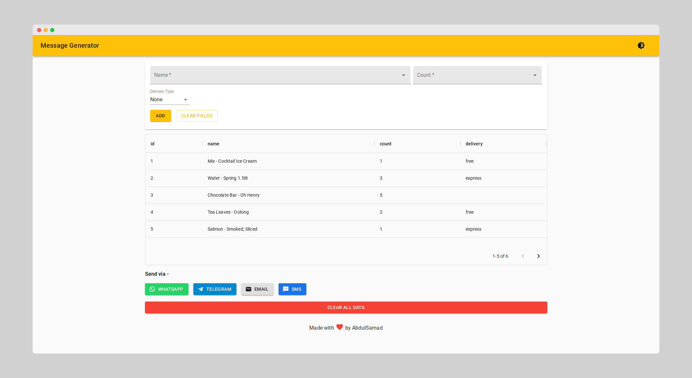

## Message Generator

Message Generator to generate preformatted messages with autocomplete support for WhatsApp, Telegram, Email, SMS. This web app can be useful for small businesses who want to order items through WhatsApp, Telegram, Email, SMS and repeat same items over and over. The autocomplete items name and count value can be changed in [data.ts](src/data.ts) file.

